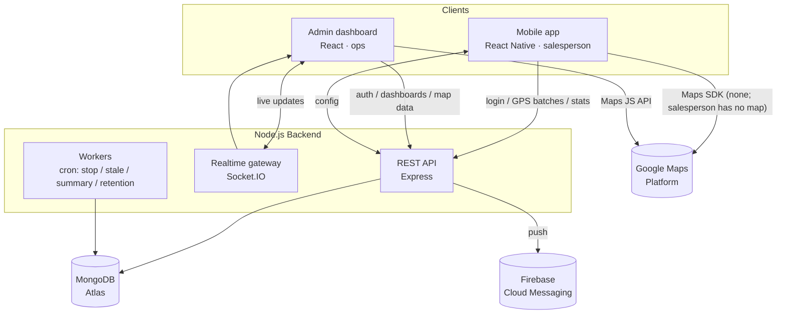
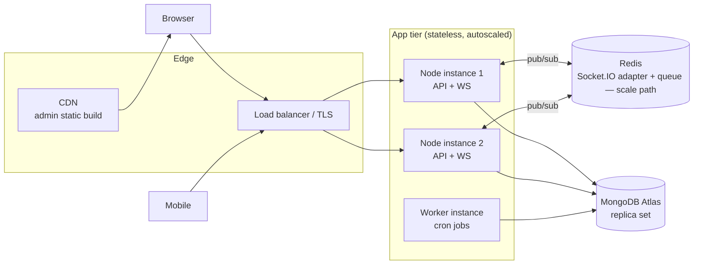
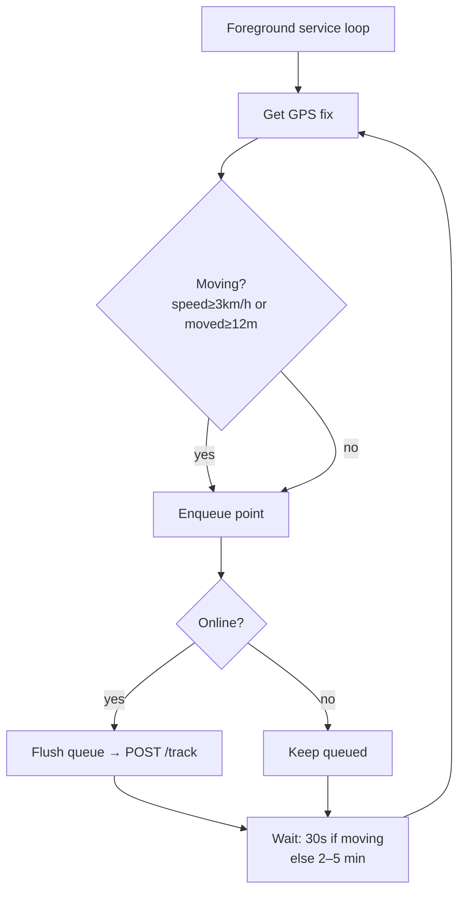
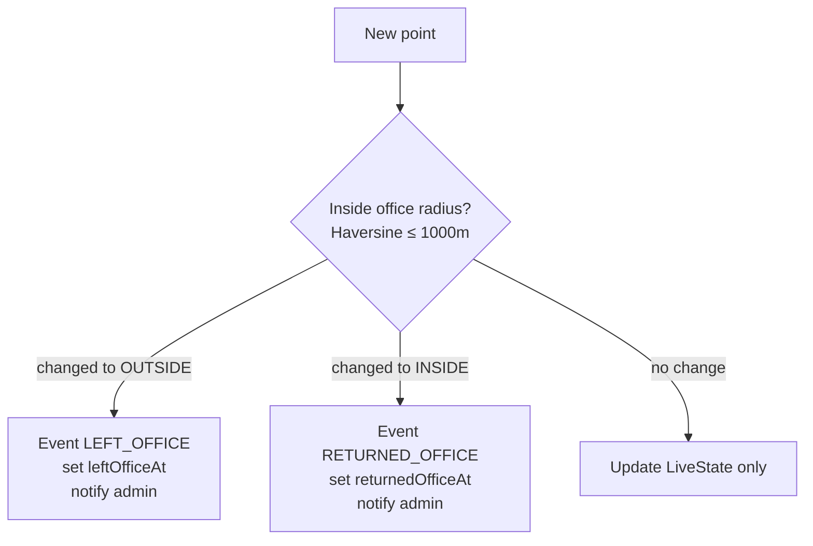
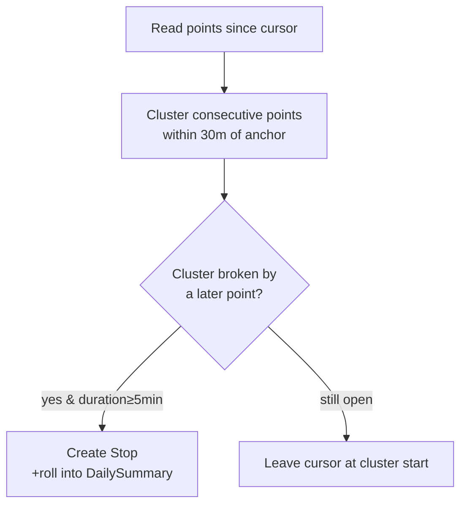
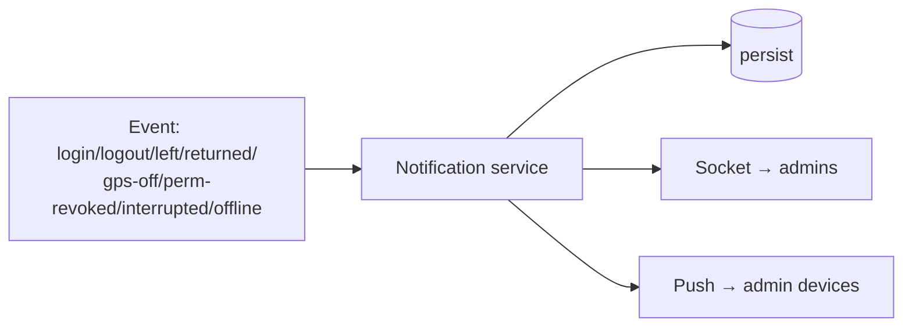
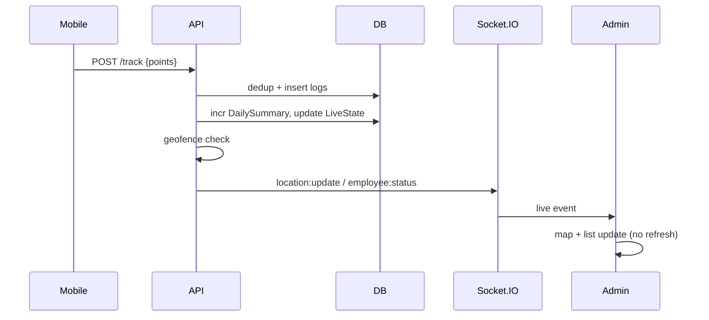

# Field Salesperson Tracking & Analytics Platform — Architecture

This document covers the 24 architecture deliverables for the platform. It
describes the system as built in this repository (`backend/`, `admin/`,
`mobile/`) and the path to scale it from 100 to 10,000+ employees.

---

## 1. High-Level Architecture

Three clients and one backend, all over HTTPS/WSS:



The salesperson app is **write-heavy** (GPS ingest). The admin dashboard is
**read-heavy** and realtime. The two concerns are separated at the data layer:
raw points land in `LocationLogs`; dashboards read pre-computed `DailySummary`
and a `LiveState` cache.

---

## 2. Low-Level Architecture (backend, clean architecture)

```
Request → Route → Middleware (auth, RBAC, validate, rate-limit)
        → Controller (HTTP only)
        → Service (business logic)
        → Model (Mongoose data access)
        → MongoDB

Side-effects: Service → Realtime gateway (Socket.IO) → admins
              Service → Notification service → FCM
Workers (cron) → Service/Model directly, independent of HTTP
```

Layers map to folders: `routes/ controllers/ services/ models/ middlewares/
workers/ realtime/ utils/ validators/ config/`. Controllers never touch the DB;
services never touch `req`/`res`.

---

## 3. System Architecture Diagram (deployment view)



For multi-instance Socket.IO, add the Redis adapter so an event emitted on one
node reaches admins connected to another. Workers run as a **separate process**
(`CRON_*` only enabled there) so they don't multiply across API replicas.

---

## 4. MongoDB Collection Design

| Collection      | Purpose                                  | Growth        | Read by |
| --------------- | ---------------------------------------- | ------------- | ------- |
| `users`         | accounts, roles                          | tiny          | all     |
| `offices`       | geofence config                          | tiny          | ingest  |
| `sessions`      | login/logout + device info               | linear/logins | admin   |
| `locationlogs`  | raw GPS points                           | **huge**      | replay  |
| `stops`         | detected halts                           | medium        | admin   |
| `dailysummaries`| pre-computed analytics (1/user/day)      | small         | **all dashboards** |
| `notifications` | admin alerts                             | medium        | admin   |
| `refreshtokens` | rotating refresh tokens                  | small         | auth    |
| `livestates`    | current status cache (1/user)            | tiny          | admin live |

`livestates` is an addition to the original 7-collection spec: it keeps the live
employee list/map O(employees) instead of scanning `locationlogs`.

---

## 5. Detailed Schema Definitions

See `backend/src/models/*.ts` for the authoritative Mongoose schemas. Key points:

- **`locationlogs`** — indexes: `{userId, timestamp}` (compound, primary read),
  `{userId, clientId}` partial-unique (offline dedup), `{timestamp}` **TTL**
  (`expireAfterSeconds = LOCATION_RETENTION_DAYS`).
- **`dailysummaries`** — unique `{userId, date}`; carries `lastLat/lastLng/
  lastPointAt` for incremental distance accumulation.
- **`stops`** — unique `{userId, startTime, endTime}` so re-runs are idempotent.
- **`refreshtokens`** — TTL on `expiresAt`; `revoked`/`replacedBy` enable rotation
  and reuse-detection.

---

## 6. API Design

All under `/api`. Auth via `Authorization: Bearer <access>`.

| Method | Path                              | Role        | Purpose |
| ------ | --------------------------------- | ----------- | ------- |
| POST   | `/auth/login`                     | public      | login → tokens + session |
| POST   | `/auth/refresh`                   | public      | rotate tokens |
| POST   | `/auth/logout`                    | any         | end session, revoke tokens |
| POST   | `/auth/register`                  | admin       | create user |
| GET    | `/auth/me`                        | any         | current user |
| GET    | `/config`                         | any         | office + tracking thresholds |
| POST   | `/track`                          | salesperson | ingest 1..500 GPS points |
| POST   | `/track/event`                    | salesperson | GPS off / perms revoked / interrupted |
| GET    | `/me/stats`                       | salesperson | today/week/month |
| POST   | `/me/fcm-token`                   | any         | register push token |
| GET    | `/admin/dashboard/overview`       | admin       | counts |
| GET    | `/admin/employees`                | admin       | live cards |
| GET    | `/admin/employees/:id`            | admin       | detail |
| GET    | `/admin/employees/:id/map`        | admin       | office + route + stops |
| GET    | `/admin/employees/:id/timeline`   | admin       | day timeline |
| GET    | `/admin/notifications`            | admin       | list |
| POST   | `/admin/notifications/read-all`   | admin       | mark read |
| GET/PATCH | `/admin/offices[/:id]`         | admin       | geofence config |

Errors use a consistent envelope: `{ error: { code, message, details } }`.

---

## 7. Socket.IO Event Design

Auth handshake uses the same JWT access token. Rooms: `admins`,
`employee:<userId>`.

| Event              | Direction        | Payload |
| ------------------ | ---------------- | ------- |
| `location:update`  | server → admins  | live position/speed/status |
| `employee:status`  | server → admins  | tracking/online/geofence change |
| `notification`     | server → admins  | new alert |
| `stop:new`         | server → admins  | detected halt |
| `summary:update`   | server → admins  | dashboard card refresh |
| `subscribe:employee` / `unsubscribe:employee` | admin → server | focus one employee's stream |

---

## 8–10. Folder Structures

**React Native** (`mobile/`): `api/ store/ navigation/ screens/ services/{location,
offline,permissions} theme/ utils/` — see `mobile/README.md`.

**Backend** (`backend/src/`): `config/ models/ services/ controllers/ routes/
middlewares/ validators/ workers/ realtime/ utils/`.

**Admin** (`admin/src/`): `api/ store/ realtime/ components/ utils/`.

---

## 11. Authentication Flow

```mermaid
sequenceDiagram
  participant App
  participant API
  participant DB
  App->>API: POST /auth/login (email, pw, device)
  API->>DB: find user, bcrypt.compare
  API->>DB: create Session + RefreshToken(jti)
  API-->>App: accessToken(15m) + refreshToken(30d) + user
  Note over App: store tokens; start tracking
  App->>API: any request + Bearer access
  API-->>App: 401 when expired
  App->>API: POST /auth/refresh (refreshToken)
  API->>DB: verify jti not revoked → rotate
  API-->>App: new token pair
```

Refresh tokens are **rotated** on every use; a replayed (revoked) token revokes
the whole chain (theft response).

---

## 12. GPS Tracking Flow (adaptive)



Cadence reduces battery, data, server load and storage growth simultaneously.

---

## 13. Geofence Detection Flow

Runs **inline on ingest** (must be immediate for notifications):



---

## 14. Stop / Halt Detection Flow

Worker (every minute), incremental per active user:



Unique `{userId,startTime,endTime}` makes re-runs idempotent.

---

## 15. Daily Summary Generation Flow

`DailySummary` is maintained **incrementally on ingest** (distance, travel time,
points, office times) and **finalised nightly** by the close worker. Dashboards
never recompute from raw logs.

---

## 16. Notification Flow



---

## 17. Offline Sync Flow

Points are enqueued to a **durable** local queue first; flushed when online;
removed only after server ACK; deduped server-side by `clientId`. Result: no
loss, no duplicates, automatic recovery across restarts.

---

## 18. Sequence Diagram — live location to dashboard



---

## 19. Deployment Architecture

- **Admin**: static build → CDN / static host (Azure Static Web Apps, S3+CloudFront).
- **Backend API+WS**: containerised (`backend/Dockerfile`), 2+ replicas behind a
  TLS load balancer (Azure Container Apps / AWS ECS Fargate / App Service).
- **Workers**: same image, separate service with only `CRON_*` enabled.
- **DB**: MongoDB Atlas replica set.
- **Realtime at scale**: Redis (Socket.IO adapter).
- **Mobile**: Play Store / App Store via standard RN release builds.

---

## 20. Scalability Strategy

- Stateless API/WS → horizontal autoscale.
- Dashboards read `DailySummary` + `LiveState` (O(employees)), never raw logs.
- Raw ingest is append-only; TTL caps storage.
- **Queue path**: move `/track` ingest + stop-detection onto BullMQ/Redis so
  spikes/offline-bursts are absorbed and workers scale independently.
- Time-based sharding / Atlas Online Archive for `locationlogs` beyond TTL.

---

## 21. Security Strategy

JWT access + rotating refresh with reuse-detection; bcrypt (cost 12); RBAC
middleware; zod validation on every input; rate limiting (tight on auth, generous
on ingest); helmet headers; CORS allow-list; TLS everywhere; secrets via env
(never committed); restricted Google Maps keys (package/bundle + API scope);
audit trail via `sessions` + `notifications`.

---

## 22. Monitoring Strategy

- **Errors**: Sentry (API + RN), Firebase Crashlytics (RN).
- **Health**: `/health` liveness/readiness (DB state) for the LB/orchestrator.
- **Logs**: structured pino JSON → CloudWatch/Azure Monitor/Loki.
- **GPS sync**: pending-queue gauge on device; ingest accept-rate on server.
- **Notification delivery**: FCM multicast results logged.
- **Worker timing**: each cron run logs duration; overlap guarded.

---

## 23. Data Retention Strategy

`locationlogs`: TTL index auto-expires after 90 days (`LOCATION_RETENTION_DAYS`);
the retention worker is the seam to archive to cold storage (Parquet on
S3/Blob) before expiry. `dailysummaries`: retained indefinitely — reports use it.
Designed for years of operation without dashboard degradation.

---

## 24. Future Expansion Strategy

The data model and clean layering leave room for new modules without redesign:
add collections + services + routes, reuse auth/realtime/workers. Candidates:
visit detection (reuse stop+geofence), client/distributor management, tasks,
orders, expenses, attendance, route optimisation & heatmaps (from `locationlogs`),
BI exports (from `dailysummaries`), and **multi-tenant SaaS** (add `tenantId`
to every collection + scope middleware; the office cache key is already
tenant-shaped).
